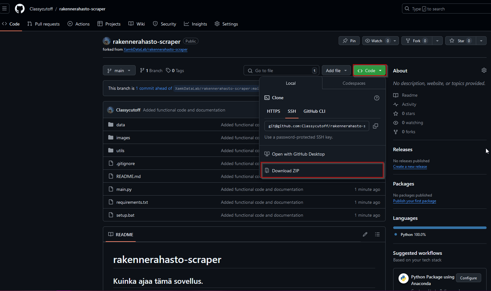
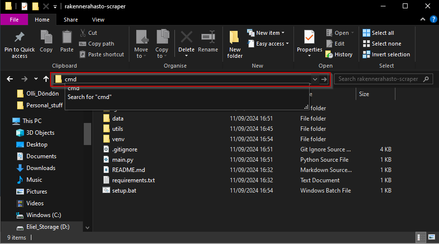
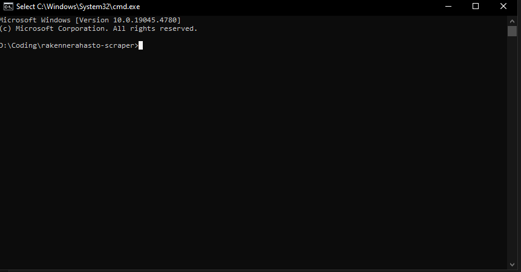

# rakennerahasto-scraper

## Kuinka ajaa tämä sovellus.

0.0 Lataa tiedostot Githubista. Helpoin tapa on ladata *.zip tiedosto, missä on kaikki tiedostot. 



0.1 Unzippaa *.zip tiedosto, jolloin se aukeaa kansioksi missä on kaikki tarvittavat tiedostot.  

1.0 Tämän sovelluksen ajamiseen tarvitsee asentaa Python ohjelmointikieli. Sen pystyy lataamaan [Tästä linkistä](https://www.python.org/downloads/).

2.0 Avaa terminaali tässä kansiossa.  

   2.1 Mene File Explorerissa tähän kansioon.  

   2.2 Täytä tekstiboksiin cmd  

  

   2.3 Tästä pitäisi aueta tämän näköinen ruutu:  

 

3.0 Kirjoita terminaaliin tämä teksti:  

```bash
setup.bat
python main.py
```
3.1 Tämä tekee ympäristön, ja ajaa ohjelman. Jos olet tehnyt jo ympäristön ja haluat pelkästään ajaa ohjelman, aja :

```bash
.\venv\Scripts\activate
python main.py
```

3.2 Ympäristön voi sammuttaa kun terminaalin kirjoittaa `deactivate` tai vain sulkemalla terminaalin.

Ohjelmassa kestää hetki, joten voit jättää sen ajamaan taustalle. Lopuksi tämä tekee CSV tiedoston data kansioon nimeltä `data/projektidata.csv`.

-
-
-
-
-
-
-
-
-
-
-
-
-
-


### Vanha dokumentaatio

Kerää dataa EURA-hankkeiden tietopalvelun verkkosivustolta https://www.eura2014.fi/rrtiepa/ ja tekee datasta pandas dataframen.

Käyttö:

extract_links kerää kaikki halutun sanan sisältävät linkit verkkosivulta. Tietopalvelu listaa kätevästi kaikkien projektien linkit samalle sivulle, ja ne sisältävät termin "projektikoodi"

Kerää kaikki projektilinkit
`links = extract_links('https://www.eura2014.fi/rrtiepa/projektilista.php?rahasto=ALL', 'projektikoodi')`

Kerätään jokaisesta linkistä projektin tiedot ja tallennetaan pandas dataframe -taulukkoon.

`projektidata = scrape_data(links)`
